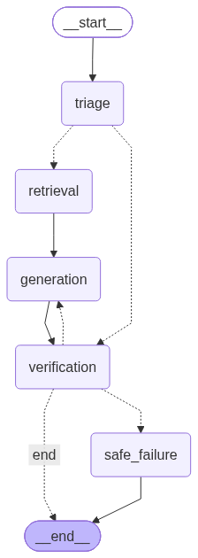

# OrbitDesk Local-First Support Agent Network

An autonomous, privacy-focused support intelligence system for OrbitDesk. Built with **LangGraph**, **Pydantic**, and **Hugging Face Transformers**, the network operates 100% locally on standard CPU hardware with zero external API calls.



---

## 🌟 Key Features

- **100% Local Execution**: Powered by local open-weights LLM and embedding models. Zero cloud latency or data privacy risk.
- **Intent Triage & Router**: Automatically classifies incoming queries into `answerable`, `requires_clarification`, `requires_escalation`, and `out_of_scope` categories using hybrid safety guardrails and local LLM logic.
- **Deterministic Priority & Superseded Filter**: Knowledge base markdown documentation (`/knowledge_base/`) serves as the primary source of truth, strictly superseding historical resolved cases marked `"status": "superseded"`.
- **Schema Validation & Retry Guardrails**: Validates all generated answers against `output_schema.json` via Pydantic (`FinalOutput`). Implements conditional loop retries and safe failure fallback after maximum retry attempts.
- **Full Traceability & Source Citation**: Cites document IDs (e.g. `KB-004`) and case IDs (e.g. `CASE-1041`) directly in response payloads.

---

## 🛠️ Models & Technical Specifications

| Component | Model Name | Revision / Source | Device | Description |
| :--- | :--- | :--- | :--- | :--- |
| **Embedding Engine** | `sentence-transformers/all-MiniLM-L6-v2` | Hugging Face Hub | `cpu` (Torch) | 384-dim dense vector embeddings for semantic document search. |
| **Generation Engine** | `Qwen/Qwen2.5-0.5B-Instruct` | Hugging Face Hub | `cpu` (Torch) | 0.5B parameter instruction-tuned local LLM for answer synthesis. |
| **Orchestration** | `LangGraph` (`StateGraph`) | PyPI (`langgraph`) | Native Python | Directed graph controlling workflow routing & loops. |
| **Schema Validation**| `Pydantic v2` | PyPI (`pydantic`) | Native Python | Output schema parsing, type-checking, and confidence scoring. |

---

## 💻 Hardware Environment Used

- **Operating System**: Linux (Ubuntu 22.04 LTS / Codespaces container)
- **CPU**: 4-Core Virtual Processor (x86_64)
- **RAM**: 16 GB System Memory
- **GPU**: None (Pure CPU inference, demonstrating high efficiency with zero VRAM requirement)

---

## 🚀 Setup & Installation

### 1. Prerequisites
Ensure Python 3.10+ is installed:
```bash
python3 --version
```

### 2. Install Dependencies
Install all required libraries specified in `requirements.txt`:
```bash
pip install -r requirements.txt
```

### 3. Verify Environment & Local Models
Run the initial environment verification script to download and cache local model weights:
```bash
python3 test_env.py
```

---

## 🧪 Running Tests & Demonstrations

### Run Vector Store Retrieval Test
Indexes markdown documentation and resolved cases into the in-memory vector store:
```bash
python3 test_store.py
```

### Run Triage Classification Benchmark
Evaluates triage accuracy across all test queries in `sample_questions.json`:
```bash
python3 test_triage.py
```

### Run End-to-End LangGraph Orchestration (Q-001)
Executes Question Q-001 through the complete compiled LangGraph workflow:
```bash
python3 test_graph.py
```

### Run Full PyTest Suite
Runs the routing test suite to verify graph conditional edges, retry bounds, and out-of-scope bypass logic:
```bash
pytest tests/test_routing.py -v
```

---

## 📁 Repository Structure

```
local-first-support-agent/
├── architecture.md             # Complete technical architecture specification
├── memory.md                   # Development progress & phase log
├── README.md                   # Main documentation & setup guide
├── requirements.txt            # Python dependencies
├── config.py                   # Central configuration & model settings
├── conftest.py                 # PyTest environment configuration
├── graph.png                   # Generated LangGraph workflow diagram
├── output_schema.json          # Output JSON Schema target
├── sample_questions.json       # Benchmark evaluation dataset
├── resolved_cases.json         # Historical resolved support cases
├── knowledge_base/             # OrbitDesk product documentation (.md files)
├── src/                        # Source Code
│   ├── graph.py                # LangGraph StateGraph builder & router edges
│   ├── state.py                # Pydantic AgentState and FinalOutput schemas
│   ├── store.py                # In-memory VectorStore and retrieval engine
│   ├── models.py               # Local Hugging Face LLM loader & generator
│   └── nodes/                  # LangGraph Execution Nodes
│       ├── triage.py           # Intent classification & safety guardrails
│       ├── retrieval.py        # Knowledge base & resolved case retriever
│       ├── generation.py       # Grounded LLM response drafting
│       ├── verification.py     # Schema validation & source mapping
│       └── safe_failure.py     # Safe failure fallback node
└── tests/                      # Automated Test Suite
    └── test_routing.py         # PyTest suite for graph conditional routing
```

---

## 🤖 AI Assistant Disclosure

This project was built in pair-programming partnership with **Antigravity (Google DeepMind)**, an AI coding assistant. Antigravity assisted in architectural design, writing modular LangGraph nodes, crafting PyTest routing tests, generating the workflow diagram, and verifying local model execution.
